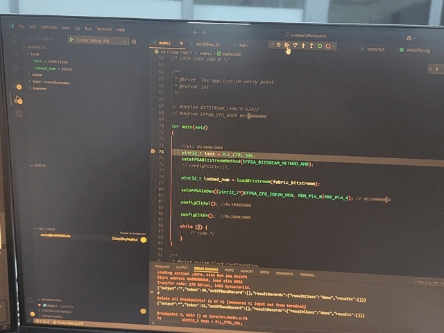
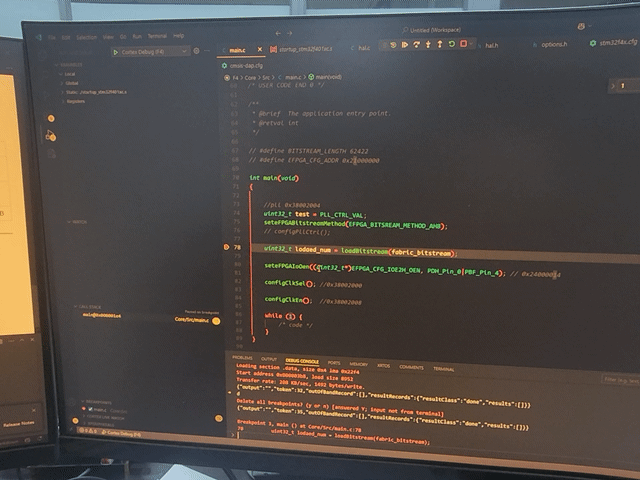
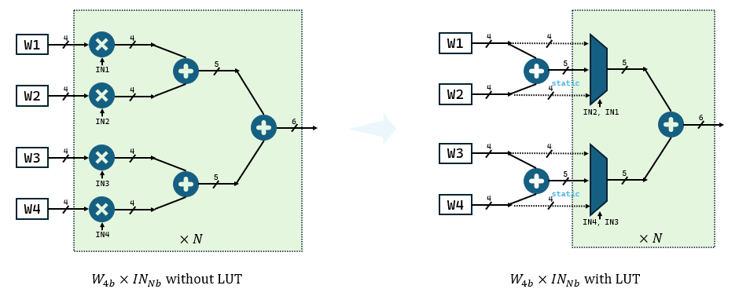
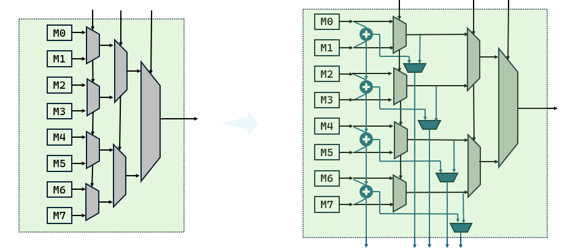

# eFPGA软硬件工作汇报

---

# 解决的问题

--

* SPI无法配置
* 多驱动情况下，EDA生成的bitstream错误

--

## 多驱动EDA问题

--

```verilog [22-24]
module multi_driver(
    input clk,
    input rst_n,

    input ina1,
    input ina2,
    output [1:0] outa,

    input inb1,
    input inb2,
    output [1:0] outb1,
    output [1:0] outb2
);

reg ina1_reg;
reg ina2_reg;
reg inb1_reg;
reg inb2_reg;
reg [1:0] outa_reg;
reg [1:0] outb_reg;

assign outa = outa_reg;
assign outb1 = outb_reg;
assign outb2 = outb_reg;

always @(posedge clk, negedge rst_n) begin
    if(!rst_n) begin 
        ina1_reg <= 0;
        ina2_reg <= 0;
        inb1_reg <= 0;
        inb2_reg <= 0;
        outa_reg <= 0;
        outb_reg <= 0;
    end else begin
        ina1_reg <= ina1;
        ina2_reg <= ina2;
        inb1_reg <= inb1;
        inb2_reg <= inb2;
        outa_reg <= ina1_reg + ina2_reg;
        outb_reg <= inb1_reg + inb2_reg;
    end
end

endmodule
```

--


### 默认情况

```json
Net 5 (outb1[1])

Node:	2940	SOURCE (0,6,2)  Class: 6  Switch: 0
Node:	2976	  OPIN (0,6,2)  Pin: 26   clb.O[0] Switch: 6
Node:	11275	 CHANY (0,6,1) to (6,2)  Track: 33  Switch: 9
Node:	6169	 CHANX (0,3,1) to (6,1)  Track: 7  Switch: 5
Node:	10667	 CHANY (0,4,1)  Track: 75  Switch: 3
Node:	5916	 CHANX (0,5,0) to (8,0)  Track: 96  Switch: 1
Node:	2454	  IPIN (0,5,0)  Pad: 10  Switch: 0
Node:	2438	  SINK (0,5,0)  Pad: 10  Switch: -1 Net_pin_index: 2
Node:	11275	 CHANY (0,6,1) to (6,2)  Track: 33  Switch: 3
Node:	5861	 CHANX (0,3,0) to (6,0)  Track: 69  Switch: 1
Node:	2450	  IPIN (0,5,0)  Pad: 6  Switch: 0
Node:	2434	  SINK (0,5,0)  Pad: 6  Switch: -1 Net_pin_index: 1
```

--

### 修改Route文件，取消wire复用

```json
Net 5 (outb1[1])

Node:	2940	SOURCE (0,6,2)  Class: 6  Switch: 0
Node:	2976	  OPIN (0,6,2)  Pin: 26   clb.O[0] Switch: 6
Node:	11275	 CHANY (0,6,1) to (6,2)  Track: 33  Switch: 9
Node:	6169	 CHANX (0,3,1) to (6,1)  Track: 7  Switch: 5
Node:	10667	 CHANY (0,4,1)  Track: 75  Switch: 3
Node:	5916	 CHANX (0,5,0) to (8,0)  Track: 96  Switch: 1
Node:	2454	  IPIN (0,5,0)  Pad: 10  Switch: 0
Node:	2438	  SINK (0,5,0)  Pad: 10  Switch: -1 Net_pin_index: 2
Node:	2976	  OPIN (0,6,2)  Pin: 26   clb.O[0] Switch: 6
Node:   11251    CHANY (0,6,1) to (6,2)  Track: 9  Switch: 3
Node:	5861	 CHANX (0,3,0) to (6,0)  Track: 69  Switch: 1
Node:	2450	  IPIN (0,5,0)  Pad: 6  Switch: 0
Node:	2434	  SINK (0,5,0)  Pad: 6  Switch: -1 Net_pin_index: 1
```

--

### 修复OpenFPGA trace routing bug

```cpp
void VprRoutingAnnotation::set_rr_node_prev_node(const RRGraphView& rr_graph,
                                                 const RRNodeId& rr_node,
                                                 const RRNodeId& prev_node) {
  /* Ensure that the node_id is in the list */
  VTR_ASSERT(size_t(rr_node) < rr_node_nets_.size());
  /* Warn any override attempt */
  if ((RRNodeId::INVALID() != rr_node_prev_nodes_[rr_node]) &&
      (prev_node != rr_node_prev_nodes_[rr_node])) {
    VTR_LOG_WARN(
      "Override the previous node '%s' by previous node '%s' for node '%s' "
      "with in routing context annotation!\n",
      rr_graph.node_coordinate_to_string(rr_node_prev_nodes_[rr_node]).c_str(),
      rr_graph.node_coordinate_to_string(prev_node).c_str(),
      rr_graph.node_coordinate_to_string(rr_node).c_str());
  }
    rr_node_prev_nodes_[rr_node] = prev_node;

}
```

---

# 性能评估

--

|benchmark|EDA关键路径|实测频率|资源占用|
|:---:|:---:|:---:|:---:|
|spi_uint8_mult(multiple cycle)|21.5ns|134.4MHz|35/90 CLB|
|spi_uint8_mult(single cycle)|21.5ns|18MHz|35/90 CLB|
|uint32_adder|8.23ns|120MHz|6/90 CLB|


---

# 存在的问题

--

## CPU异常

* 低频率下(8M)CPU调试断点异常
* 低频率下(8M)bitstram烧录错误。


--

### 断点错误

**异常**



--

**正常**



--

### bitstream烧录错误

对于`uint32_adder`，虽然bitstream烧录错误（通过spi读出进行校验），但是外在表现正常。

对于`spi_uint8_mult`,读取结果全0。

---

# 下一步的计划

--

* uint8宏单元（局部脉动以及全局脉动）
* 基于乘法优化LUT
* 基于benchmark的互联架构优化

--

## 基于LUT乘法器的优势



--

|类型|面积|功耗|时序|
|:--:|:--:|:--:|:--:|
|mac|533.96|0.7334mw|1ns|
|mac_lut|288.12|0.4016mw|1ns|


--

## 初步人融合想法



