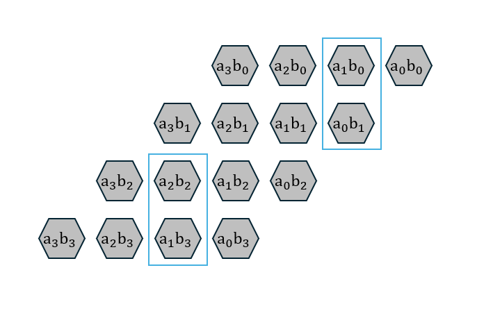

# yosys宏单元优化汇报

---


# 提取Yosys乘法算子

--

## 默认情况


```bash

Pb types usage...
  separate_io          : 6
   separate_i          : 5
   separate_o          : 1
  clb                  : 35
   fle                 : 256
    lut3               : 1
     lut               : 1
    adder              : 6
    lut4               : 245
     lut               : 245
    ff                 : 66
     ff_with_low_reset : 62
     ff_without_reset  : 4

```

**49M**

--

## 使用yosys mul2dsp techmap


--


```bash
Pb types usage...
  separate_io          : 6
   separate_i          : 5
   separate_o          : 1
  clb                  : 86
   fle                 : 461
    lut3               : 40
     lut               : 40
    adder              : 314
    lut4               : 129
     lut               : 129
    ff                 : 66
     ff_with_low_reset : 62
     ff_without_reset  : 4
```

**27M**


--

## 自定义提取算子


--


```bash
Pb types usage...
  separate_io          : 6
   separate_i          : 5
   separate_o          : 1
  clb                  : 35
   fle                 : 228
    lut3               : 58
     lut               : 58
    adder              : 125
    lut4               : 98
     lut               : 98
    ff                 : 66
     ff_with_low_reset : 62
     ff_without_reset  : 4
```

**20M**

---

# 评估总结

--

|    类型     | 资源消耗 | 性能  |
| :---------: | :------: | :---: |
|    默认     |   100%   | 100%  |
|   mul2dsp   |   180%   |  49%  |
| simple mult |   89%    |  41%  |


---


# 结果分析

--

## LUT4的缺陷





--


---

# 下一步计划

1. 重新从PT中提取路径延时，尽量减小eda评估误差
2. 尝试使用并行加法树来优化自定义乘法提取算子，对比不同实现的PPA
3. 评估不同规模的乘法，使用LUT与使用ADDER之间的权衡,对比PPA
4. LUT4与adder宏适配性较差，考虑换成LUT5-LUT6
5. MX乘法阵列实现，与传统FP进行PPA对比。使用Koios 2.0 Benchmarks


