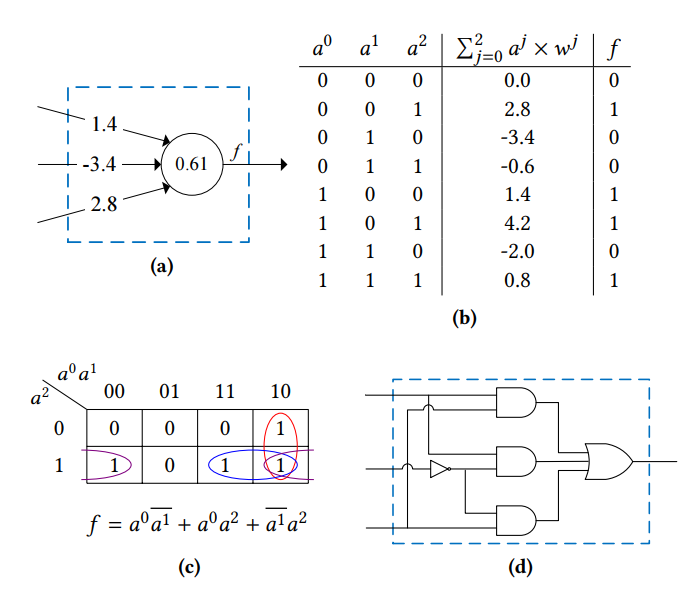

# 综合进展 {data-stack-name="综合"}

## yosys提取乘算子的具体实现

**基于** `spi_mult` 的测试结果

>为了充分利用ADDER宏模块

## 测试结果

|         类型         | CLB数量 | FLE数量 | ADDER数量 | FF数量 |     CPD     |
| :------------------: | :-----: | :-----: | :-------: | :----: | :---------: |
|         raw          |   35    |   256   |     6     |   66   |   21.4935   |
| yosys inner mult2dsp |   86    |   461   |    314    |   66   |   42.8063   |
|        simple        |   35    |   228   |    125    |   66   |   25.9454   |
|        booth         |   60    |   419   |    195    |   66   |   25.7731   |
|     **boothv2**      | **33**  | **243** |  **74**   | **66** | **20.9157** |

## 测试ADDER宏阈值

* 测试adder的threshold从0-60，找出效率最高的threshold
* 当前部分benckmark会将memory综合为带有使能的FF，仍然需要修改yosys映射规则

::: {.longtable style="height: 500px;"}
|    benchmark     | lut4  | adder | dpram8k |  ff   |
| :--------------: | :---: | :---: | :-----: | :---: |
|     arm_core     |       |       |         |       |
|       bgm        |       |       |         |       |
|    blob_merge    |       |       |         |       |
|     boundtop     |       |       |         |       |
|  ch_intrinsics   |       |       |         |       |
|     diffeq1      |       |       |         |       |
|     diffeq2      |       |       |         |       |
|     LU8PEEng     |       |       |         |       |
|    LU32PEEng     |       |       |         |       |
|    LU64PEEng     |       |       |         |       |
| matmul_8x8_fp16  |       |       |         |       |
|       mcml       |       |       |         |       |
| mkDelayWorker32B |       |       |         |       |
|    mkPktMerge    |       |       |         |       |
|  mkSMAdapter4B   |       |       |         |       |
|      or1200      |       |       |         |       |
|    raygentop     |       |       |         |       |
|       sha        |       |       |         |       |
|      spree       |       |       |         |       |
|  stereovision0   |       |       |         |       |
|  stereovision1   |       |       |         |       |
|  stereovision2   |       |       |         |       |
|  stereovision3   |       |       |         |       |
|  tpu.16x16.int8  |       |       |         |       |
|  tpu.32x32.int8  |       |       |         |       |
:::

# 宏模块进展 {data-stack-name="宏模块"}

## MX格式调研

## 数据类型

支持的格式类型(其中FP类型都会有两种子类型)

|  Name  | Element Data type |   d   |   k   | Scale Data Type |   w   |
| :----: | :---------------: | :---: | :---: | :-------------: | :---: |
| MXFP8  |        FP8        |   8   |  32   |      E8M0       |   8   |
| MXFP6  |        FP6        |   6   |  32   |      E8M0       |   8   |
| MXFP4  |        FP4        |   4   |  32   |      E8M0       |   8   |
| MXINT8 |       INT8        |   8   |  32   |      E8M0       |   8   |

**使用FP8和INT8构成systolic，融合FP8近似计算（尝试，非必需），构成DSP MACRO**

# 基于LUT的模型实现 {data-stack-name="LUT DNN"}

## NullaNet

::: {.container}
:::: {.col}

::::
:::: {.col}

::::
:::

**无需额外的sram用于存储Weights**

# 谢谢 {.slide-count-end data-background-image="$reporoot-url$/markdown_revealjs/themes/ucas_ict_thesis/liquid-cheese_sky_title.svg" data-sminvisible=true}

