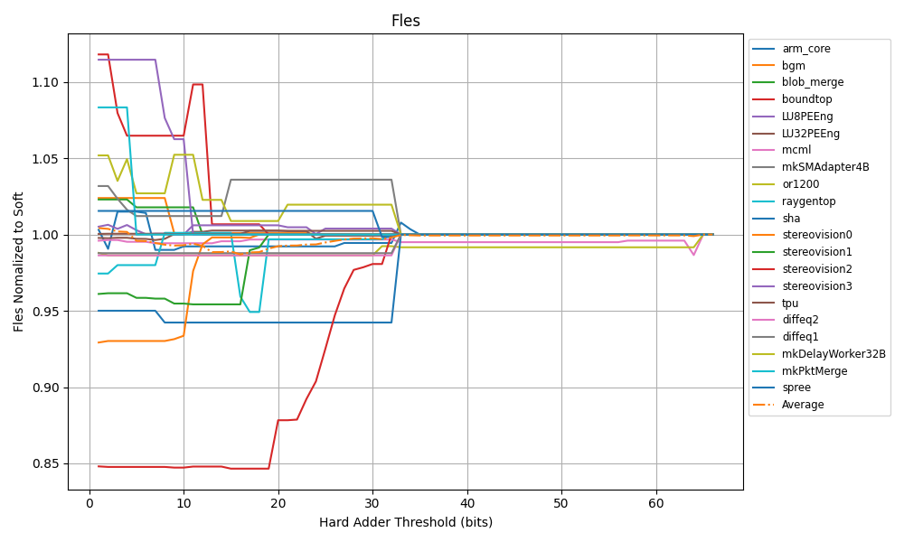

# Yosys综合

## 综合鲁棒性

* 支持赋初值`reg a = 0;`操作
* 支持ROM综合
* 支持异步低电平置位
* 单口ram/双口ram(transparent or non-transparetn)

# VTR Benchmark评估

## 资源消耗

# Adder Threshold测试

## 基于simple Adder

## 基于VTR Benchmark的测试

## 

## 

## 

**综合Simple与VTR测试的结果，后续将阈值定为16**

# 谢谢 {.slide-count-end data-background-image="$reporoot-url$/markdown_revealjs/themes/ucas_ict_thesis/liquid-cheese_sky_title.svg" data-sminvisible=true}

